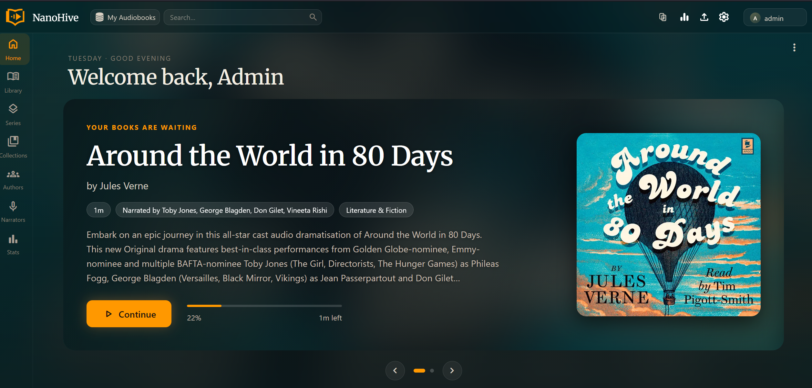
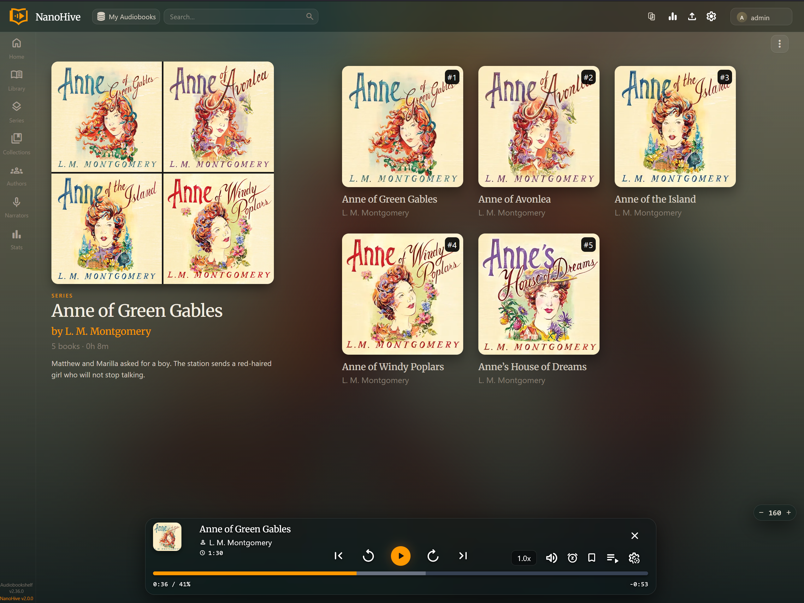
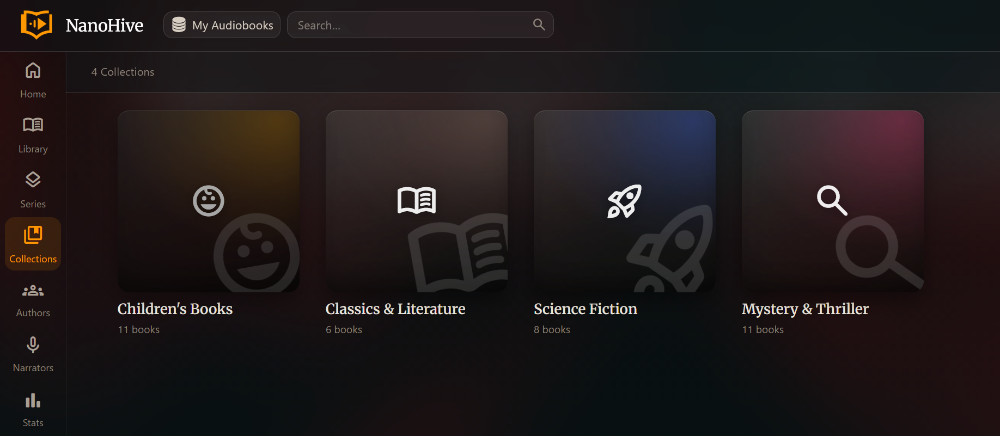
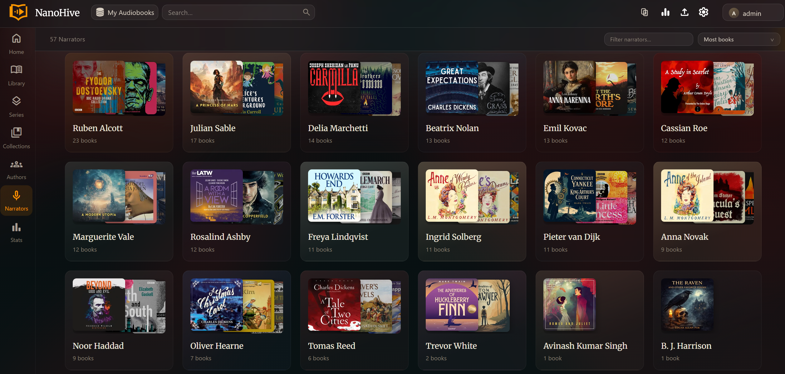
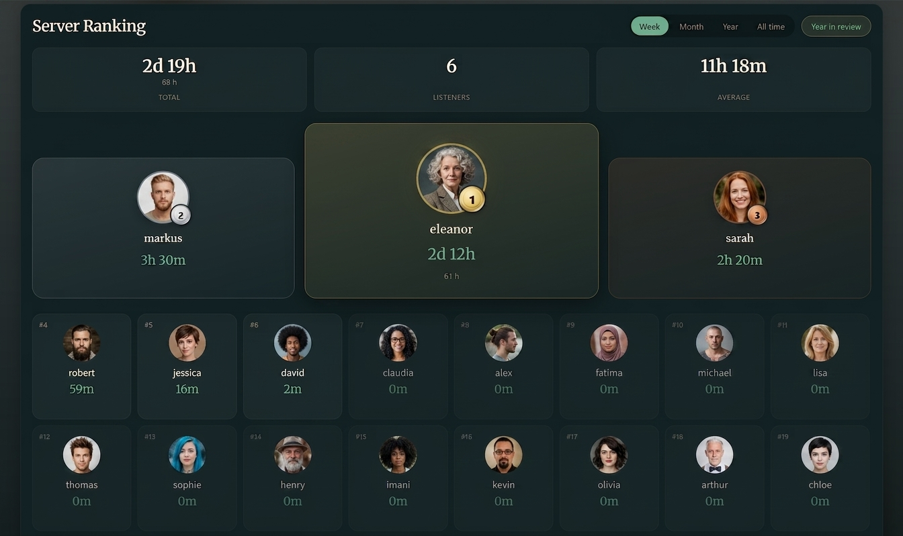
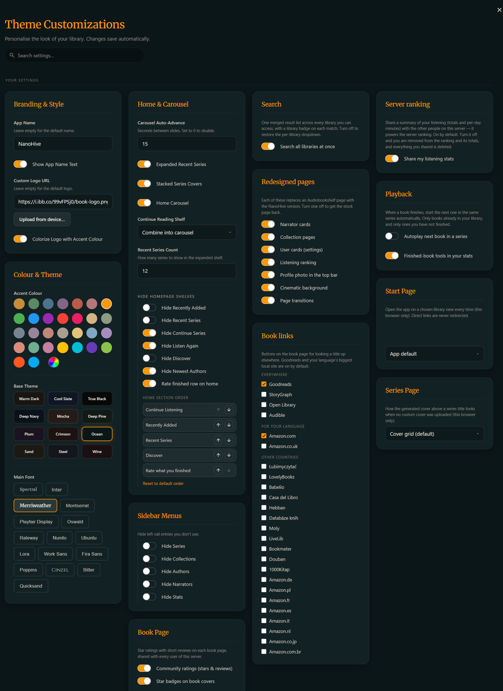

# NanoHive Audiobookshelf Theme

A drop-in reverse proxy that themes **Audiobookshelf Web** for every user — no Tampermonkey, no
per-browser setup. Put it in front of your ABS server and it injects the theme's CSS and JS
into the HTML it serves.

Nothing is written to your ABS container: remove the proxy and you're back to stock. Web only —
the ABS mobile apps render natively and keep working through the proxy, just unthemed.

|  |  |
|:--:|:--:|
|  |  |
|  |  |
|  |  |



## What it changes

**Look and feel** — a warm, cinematic dark palette with 12 base themes and a configurable
accent colour; a real mobile layout (drawer navigation, touch-friendly appbar, no horizontal
overflow); covers that follow your library's aspect setting everywhere, including the detail
page.

**Home page** — a hero carousel of your in-progress books, with a pause button that remembers
your choice. An expanded Recent Series shelf (ABS caps its own at 5, and you can keep the stock
look if you prefer it), a *Rate what you finished* row, and reorderable sections so you decide
what sits at the top. Ebooks in progress can join the carousel, stay a separate shelf, or be
hidden.

**Ratings and reviews** — server-wide, Goodreads-style: stars, a community score and short
reviews on every book page, shared between all users. Stars appear on every card (library grid,
home shelves, series, collections), and whole series can be rated too, with a books-average line
beside the series rating. You can also **import your ratings from StoryGraph or Goodreads** —
[details below](#ratings-reviews-and-importing).

**Finding things**: search across every library at once with a library badge on each hit; a
rebuilt **Filter & sort** panel on the library and series pages replacing ABS's two dropdowns
with one: sort by several things at once with the precedence and direction of each level in
front of you (and Author sorts by surname or by first name, your choice), and stack filters
across genre, author, narrator, series, tag, publisher, language, year, progress, format and
rating, every value listed with its count and searchable. Whatever is active shows as chips in
the toolbar, so dropping one filter takes a single click. The series page gets it too: sort by
name, rating, number of books or how far through you are. Prefer the old menus? One toggle
brings them back with nothing lost. Plus a per-user start page.

**Rebuilt pages** — the book detail page: HD cover, blurred cinematic background, restructured
metadata, Started and finished dates (the finished one editable), and lookup links to Goodreads
plus your language's biggest local site, 25 logos bundled. Collections become an instant
icon-emblem grid instead of slow cover cards, with curated starter templates and editable
descriptions. Narrators and Authors become cards with cover collages, book counts, a filter box
and sorting.

**Stats** — a **Server Ranking** of everyone by listening time, with medals, week/month/year/
all-time and a per-user drill-down; **Your listening** insights (current and longest streak,
weekly pace against the week before, which weekday you actually listen on, most-listened books,
authors and narrators); a **Year in Review**; and **finished-book tools** — recently finished
with an editable date, plus books stuck at 97–99% with one tap to mark them done. Admins also get
a **Server statistics** page: what the whole server plays most, best rated, top genres and
authors, filterable per library. Non-admins can see the ranking through opt-in
[family stats](#family-listening-stats).

**Reading** — an extended ereader in your theme colours, with a typeface picker offering curated
serif, sans-serif and dyslexia-friendly (OpenDyslexic) fonts, and floating-player fixes.

**Playback** — **Autoplay** the next book in a series when one finishes (off by default), with a
notice naming what started.

**For admins** — save your current look as the **server-wide default** in one click (no compose
editing, survives updates); upload a **custom logo** the server hosts itself; upload
**series covers** and **series descriptions**; manage **profile photos** for users (shown in
the top bar and the ranking); read and clear the queue of **problems users report** from a book
page (missing content, bad audio, won't play, wrong metadata, bad chapters, other); and
**Tidy authors** left behind with no books.

**Everyone gets their own** — an in-app settings panel (the gear icon) where each user picks their
theme, font, accent, and which shelves and sidebar entries to show. Settings are **per account,
not per device**, so a shared tablet stops handing one person's look (and playback speed) to
whoever signs in next, and they follow you to another browser. The panel and carousel are
translated into all 40 languages ABS ships.

**Series at a glance**: a mark in the corner of a series cover once you have actually **finished**
a book in it: a green tick when every book is done, an orange ring showing how far through the
series you are when only some are. A series you have merely started, or never opened, stays clean.

## Run it

```bash
docker run -d \
  -p 8080:80 \
  -v nh_theme_data:/data/nh \
  -e ABS_UPSTREAM=http://your-abs-host:80 \
  ghcr.io/rodzalendo/nanohive-abs-theme:latest
```

Point your browser (or reverse proxy / Cloudflare tunnel) at port 8080 instead of ABS directly.
See `docker-compose.example.yml` for a compose setup.

**Dashboard icon.** Unraid, Portainer and similar let you point a container at an icon URL. Use:

```
https://raw.githubusercontent.com/rodzalendo/nanohive-abs-theme/main/docs/nanohive-logo.png
```

- **Already serving ABS on the port your users know?** Move ABS to another port and publish the
  theme container on the old one, so existing bookmarks keep working.
- **Behind your own TLS proxy** (nginx, NPM, Traefik, Cloudflare tunnel) is fully supported,
  including OIDC login — the incoming `X-Forwarded-Proto` is forwarded untouched (v1.8.0+).
- **Mount `/data/nh`.** Everything the theme stores lives there; without a volume it is all lost
  when the container is recreated. [See what lands in it.](#the-datanh-volume)

### TrueNAS SCALE

Keep the Audiobookshelf app exactly as it is and add the theme as a second app beside it. On
SCALE 24.10 ("Electric Eel") or later: **Apps → Discover → Custom App → Install via YAML**:

```yaml
services:
  abs-theme:
    image: ghcr.io/rodzalendo/nanohive-abs-theme:latest
    restart: unless-stopped
    ports:
      - "30081:80"          # any free port; open http://<truenas-ip>:30081
    environment:
      ABS_UPSTREAM: "http://<truenas-ip>:30013"   # your ABS app's web port
    volumes:
      - /mnt/tank/apps/nanohive:/data/nh          # any dataset path; persists defaults + uploads
```

On older (k3s-based) releases use the **Custom App** form with the same four things: image,
`ABS_UPSTREAM`, port mapping, and host-path storage for `/data/nh`.

`ABS_UPSTREAM` must be the **TrueNAS host IP plus the ABS app's published port** — not
`localhost` (that is the theme container itself) and not the ABS container name, because
catalog apps live on auto-generated `ix-…` networks a custom app cannot see. If a reverse proxy
fronts your NAS, point it at the theme's port instead of ABS's; the mobile apps can keep using
the raw ABS port.

## Configuration

Only `ABS_UPSTREAM` is required. The `NH_*` variables set the
**defaults a user sees on their first visit**; anyone can then override them for themselves
in the settings panel.

Precedence: **a user's saved settings** beat **UI-saved server defaults** beat
**your env vars** beat the built-in defaults.

| Variable | Default | Notes |
|---|---|---|
| `ABS_UPSTREAM` | *(required)* | Where ABS actually listens, e.g. `http://audiobookshelf:80` |
| `NH_APP_NAME` | *(empty)* | Replaces "audiobookshelf" in the appbar. No `"` or `\` |
| `NH_SHOW_LOGO_TEXT` | `true` | Show the app name beside the logo. `true`/`false` only |
| `NH_LOGO_URL` | *(empty)* | Custom logo: an external URL, or `/_nh/logo.<ext>` for one the server hosts itself (works offline — see below). No `"` or `\` |
| `NH_COLORIZE_LOGO` | `false` | Tint the logo with the accent colour. `true`/`false` only |
| `NH_ACCENT_COLOR` | `#e0c27a` | Any hex colour |
| `NH_BASE_THEME` | `warm` | `warm` `slate` `black` `navy` `mocha` `pine` `plum` `crimson` `ocean` `sand` `steel` `wine` |
| `NH_MAIN_FONT` | `Merriweather` | Any Google Font offered in the settings panel |
| `NH_FONT_SCALE` | `1.0` | Global text scale |
| `NH_CAROUSEL_TIMING` | `15` | Seconds per hero slide; `0` disables auto-advance |
| `NH_SHOW_HERO_CAROUSEL` | `true` | The home hero carousel. `true`/`false` only |
| `NH_SHOW_RECENT_SERIES` | `true` | The expanded Recent Series shelf. `true`/`false` only |
| `NH_RECENT_SERIES_COUNT` | `12` | Series shown in that shelf |
| `NH_CUSTOM_SERIES_CARDS` | `true` | Stacked series covers; `false` = stock ABS cards (keeps font + count badge) |
| `NH_SHOW_RATINGS` | `true` | Server-wide book ratings on the book page. `true`/`false` only |
| `NH_FOUC_BG` | `#181512` | Background painted before the theme loads. Match your base theme's canvas |
| `THEME_VERSION` | *(build stamp)* | Informational; printed at startup |

The container refuses to start on a malformed value (a non-boolean where a boolean is required,
or a quote in `NH_APP_NAME`) rather than serving a half-broken page.

**Canvas colours** for `NH_FOUC_BG`: `warm` `#181512` · `slate` `#111625` · `black` `#080808` ·
`navy` `#0a111a` · `mocha` `#231c18` · `pine` `#121a15` · `plum` `#1a1320` · `crimson`
`#1d1212` · `ocean` `#0b1618` · `sand` `#1c1814` · `steel` `#13171c` · `wine` `#1a1014`

### Server defaults from the UI (recommended)

Admins get a **Server Defaults** card at the bottom of Settings → Theme. *Save* stores your
current settings as the default for every user, in `/data/nh/server-config.json`; *Clear*
removes them and resets your own browser. Writes are admin-only — the proxy replays your ABS
login token against an admin-only ABS endpoint before accepting one.

### Custom logo (including offline / air-gapped)

`NH_LOGO_URL` (or the **Custom Logo** field in the panel) can point at any external image. For
a server with **no internet access**, host it on the proxy instead:

- **Easiest:** Settings → Theme → *Branding & Style* → **"Upload from device…"** (admins only).
  Uploaded and applied in one click.
- **Manual:** drop the image into the `/data/nh` volume as `logo.png` (or `.svg`, `.jpg`,
  `.webp`, …) and set the logo to `/_nh/logo.png`.

Either way it is served same-origin from the volume, so it loads with no outbound request.

### Ratings, reviews and importing

A rating block sits under the Play/Read buttons on every book page: big stars filled to the
**community average** with the score beside them, and a "N ratings · M reviews" link opening a
popup of everyone's stars, dates and review text. Hover the stars to preview your own rating
and click to save it; yours then gets its own line with *Add/Edit review* and *Remove*. Turn it
off per-user in Settings → Theme → *Book Page*, or server-wide with `NH_SHOW_RATINGS=false`.

**Rating precision** (*Star rating steps*) is full, half (default) or quarter stars, governing
both what you can pick and how every rating is drawn — so whole-star mode never shows a
partly-lit glyph.

**Ratings are per library.** Podcast libraries are excluded by default — book ratings and the
*Rate what you finished* row have no business in a podcast feed — and each library can be switched
on or off under *Ratings per library*. That row only ever offers books from the library you are
looking at.

#### Importing from StoryGraph or Goodreads

Export your books, then pick the file under *Import ratings* (Settings → Theme → *Book Page*):

- **StoryGraph** — Manage Account → *Manage Your Data* → **Export StoryGraph Library**. The CSV
  arrives by email.
- **Goodreads** — My Books → *Import and export* (Tools, in the left sidebar) →
  **Export Library**. Wait a moment and a "Your export from \<date\>" link appears above the button.

Rows are matched against your own libraries by ISBN-13/ISBN-10 or Amazon ASIN first, then by
title and author, then by a scored close-match pass for the rows an export leaves without any
identifier — and **nothing is written until you confirm it**. The dry run lists what matched
and why, what is worth a second look (with a picker over the runner-up candidates and an
explicit *skip*), what you have already rated, and what is not in your library at all. Books
you rated yourself are held back unless you tick *overwrite*, written reviews come along if you
want them, and quarter-star ratings keep their exact value. Only libraries that take part in
ratings are searched. Goodreads exports whole stars only; StoryGraph's quarter stars survive
intact.

#### How ratings work

- Stored on the proxy at `/data/nh/ratings.json` in quarter steps (0.25–5). ABS itself is never
  written to.
- Every read and write is validated against ABS with the caller's own login token (nginx
  `auth_request`), so a rating is always filed under the real logged-in user and nobody can rate
  as someone else.
- Admins can remove any user's rating (a *remove* link in the reviews popup) — handy moderation
  for family servers. That goes through an admin-gated twin route (`/_nh/api/ratings-admin`),
  because current ABS tokens no longer say whether the caller is an admin: nginx proves it by
  replaying the token against an admin-only ABS endpoint rather than trusting the token.
- The API is nginx's built-in njs engine at `/_nh/api/ratings` — no extra container or database.
  It also takes a bulk form, `{ "items": [ … ] }`, so the importer writes a whole export once
  instead of a hundred times; a bulk call can only ever write the caller's own ratings.

### Family listening stats

The Server Ranking on **Settings → Your Stats** is built from real listening data when an admin
views it. So everyone else can see a board too, each browser can publish a small summary of its
own listening to the proxy.

- Sharing is **on by default**. Turn it off in Settings → Theme → *Family stats* and your shared
  summary is deleted, you disappear from the ranking, and you stop counting toward its totals —
  for everyone, admins included.
- The summary lives at `/data/nh/stats.json` (`/_nh/api/stats`): totals, per-day minutes and your
  top few titles. Never anything ABS doesn't already know.
- Only your own record can be written — the user id comes from your verified login token, never
  from the request body.

### The `/data/nh` volume

Mount it or you lose all of this when the container is recreated:

| File / folder | What it holds |
|---|---|
| `server-config.json` | UI-saved server defaults |
| `ratings.json` | book and series ratings + reviews |
| `stats.json` | opt-in shared listening summaries |
| `collection-art.json` | per-collection icon and accent overrides |
| `reports.json` | problem reports users filed from a book page |
| `prefs.json` | each user's own theme settings, so they follow them between browsers |
| `series-covers/` | uploaded series cover images |
| `series-desc/` | series description overrides |
| `user-avatars/` | user profile photos |
| `logo.*` | uploaded custom logo |

**What is readable without logging in.** Images and text that the browser has to draw before
anyone has signed in are served unauthenticated, same-origin: the logo, series covers, series
descriptions, profile photos, the collection art map, and the saved server defaults. Ratings,
reviews, listening summaries, problem reports, saved settings and started/finished dates are
**not**. Those go through the API and require the caller's own Audiobookshelf login, and each
only ever returns the caller's own rows. Worth knowing before you
upload a profile photo you would not want a stranger with the URL to see.

### Where settings live

Three layers, none of which touch your Audiobookshelf database:

1. **Your env vars.** nginx reads the `NH_*` variables at container start and injects them into
   every page as `window.NH_CONFIG`. Change one, restart, and every user who hasn't customised
   that particular option sees the new value.
2. **UI-saved server defaults** sit above the env vars, written to `/data/nh` and injected into
   every page before first paint.
3. **Each user's overrides**, saved the moment they change something. These are stored twice: in
   the browser under `nh-settings:<your user id>`, which is what the page reads before first
   paint so nothing flashes, and on the server under `/data/nh/prefs.json`, which is what lets
   the same settings follow you to another browser or phone. The browser copy is authoritative
   at load; the server copy syncs in the background, and whichever was saved last wins.

Only the specific keys a user changed are stored; anything they never touched isn't saved at all,
so later changes to your defaults still reach them.

**On a shared device** (one tablet, several family members) every account keeps its own look.
That covers Audiobookshelf's own preferences too, not just the theme's: playback speed, jump
amounts, sort order and cover size are stored by Audiobookshelf in one browser-wide entry, so
before v2.1 whoever changed them changed them for whoever signed in next. NanoHive now keeps a
per-account copy and restores it at sign-in. The first account to sign in after updating keeps
the look the device already had; everyone else starts from your defaults.

To reset yourself, clear the site's data, or run this in the browser console and reload:

```js
Object.keys(localStorage).filter(k => k.startsWith('nh-settings')).forEach(k => localStorage.removeItem(k));
location.reload();
```

## How it works

nginx proxies everything to ABS untouched, then rewrites the HTML on the way out:

1. `window.NH_CONFIG` is injected into `<head>`, carrying the env-var defaults.
2. `core.js` and `nh-early.js` are **inlined** into `<head>` via SSI. `core.js` patches
   `fetch`/`XHR` before the ABS bundle boots; `nh-early.js` applies the resolved theme before
   first paint, so the page never flashes the stock palette.
3. `enhancements.js` and `book-details.js` are inlined before `</body>`.

Because the scripts are inlined rather than linked, browsers never cache them separately —
rebuild the image and the next page load is already running the new code.

Upstream compression is disabled so `sub_filter` can rewrite the HTML, and WebSocket upgrades
are passed through for ABS's Socket.IO progress sync.

## Compatibility

The theme targets ABS's current DOM, so when Audiobookshelf ships a UI change some selectors
may break until the theme files are updated. Verified against Audiobookshelf **2.35.1** and
**2.36.0** — open an issue with your ABS version if something looks wrong.

Not affiliated with the Audiobookshelf project.

## Build

Edit the files in `theme/` and rebuild; there is nothing to cache-bust.

```bash
docker build -t nanohive-abs-theme .

# multi-arch (amd64 + arm64 for Pi/NAS):
docker buildx build --platform linux/amd64,linux/arm64 \
  -t ghcr.io/rodzalendo/nanohive-abs-theme:latest --push .

# keep the theme readable inside the image (default is minified):
docker build --build-arg NH_MINIFY=false -t nanohive-abs-theme .
```

The payload is minified at build time (`NH_MINIFY=true` by default), worth about a third of
its size. Set it to `false` when you want to read or patch the injected JS inside a running
container.

## License

MIT. See [LICENSE](LICENSE).
